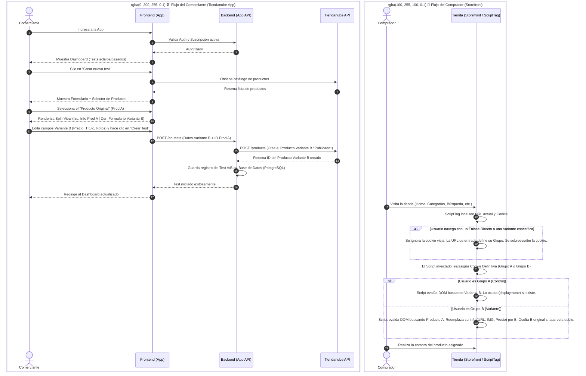

# 🏗️ Tiendanube A/B Testing App - MVP Architecture

> **Nota para IAs y Desarrolladores:** Este documento es la fuente de verdad arquitectónica del MVP. Define cómo fluye la información entre el Frontend (Dashboard), el Backend (Node.js/Prisma) y el Storefront (La Tiendanube visualizada por los clientes finales).

## 📊 1. Diagrama de Flujo del "Happy Path"

El sistema se divide en dos grandes experiencias: la del **Comerciante** (creando el test) y la del **Comprador** (experimentando el test en la tienda).

---

## 🧠 2. Pilares de la Solución Técnica

Para evitar problemas de Checkout, el Producto Variante B se creará en Tiendanube como un producto real, activo y publicado. Las siguientes tres lógicas protegen la experiencia para que los clientes nunca vean productos duplicados:

### A. Sincronización de Stock mediante Webhooks
Tiendanube no permite que dos productos compartan el mismo inventario orgánicamente. 
- **Solución**: El Backend se suscribirá a los Webhooks de Tiendanube (ej. `order/created`). Cada vez que un cliente concrete una compra del Grupo A emparejado o Grupo B, el servidor calculará y descontará la misma cantidad de stock del producto "hermano".

### B. Rendimiento Máximo: La Cookie Inteligente
La App en el backend inyectará un ScriptTag a la tienda. Para evitar peticiones `GET` constantes desde el navegador del cliente hacia nuestra base de datos (lo que sumaría latencia y provocaría parpadeos en pantalla (FOUC)):
- La cookie (o `localStorage`) del usuario almacenará la regla directamente tras la primera y única consulta periódica. Ej: `ab_test_active: { original: 100, variant: 200, group: "B" }`.
- El script de Front usará esta información estática para manipular el DOM instantáneamente.

### C. Estrategia de Ocultación en el DOM (3 Capas de Seguridad)
Dado que los diferentes temas (Themes) de Tiendanube tienen estructuras HTML variadas, el ScriptTag buscará los productos a ocultar en este orden de prioridad:
1. **Atributos Estándar (Capa A)**: Buscar contenedores con `data-product-id={ID}` o clases como `js-item-product` (Presentes en el 95% de los temas basados en Skeleton/Nuvemshop).
2. **Modo "Sabueso" / Href Sniffing (Capa B)**: Buscar enlaces (`<a href=".../slug-del-producto-b">`) y ascender por el árbol HTML usando `.closest()` hasta encontrar una caja contenedora y aplicarle `display: none`.
3. **Capa Manual (Capa C / Fallback)**: En caso de temas a medida totalmente herméticos, permitir al comerciante ingresar un selector CSS manual desde el Dashboard de la App.

### D. Regla de Oro de UX: "La URL Manda"
Prevemos el caso en el que un usuario del Grupo A recibe por WhatsApp un enlace directo a la Variante B y hace clic.
- En lugar de redirigir al Grupo A y generarle confusión con el precio/texto que le prometieron por chat, **la URL de destino tiene prioridad**.
- El ScriptTag detectará el "intento de entrada forzada", cambiará al usuario transparente al Grupo B, y dejará que navegue el Producto Variante B con normalidad.
